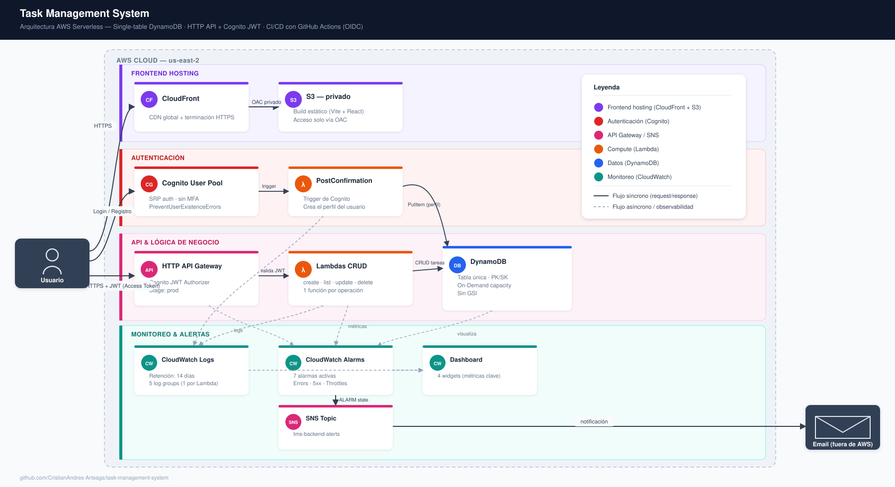
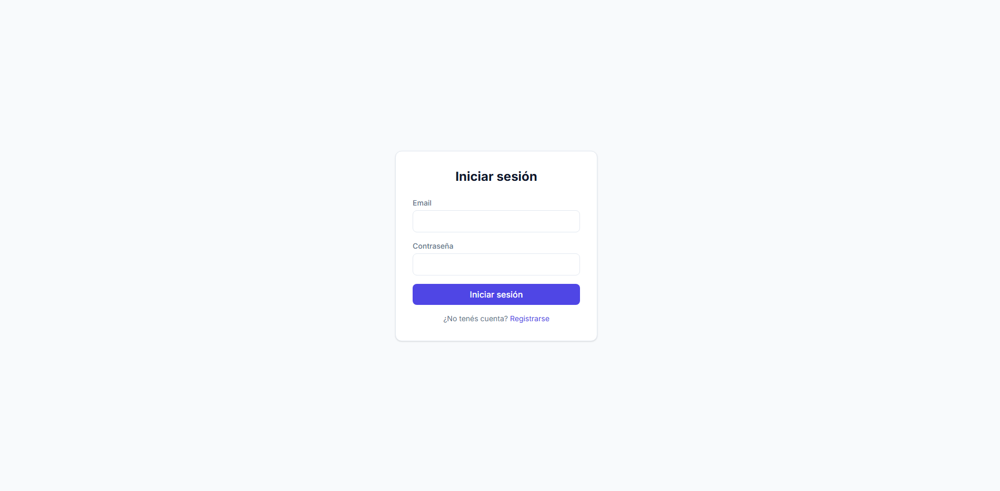
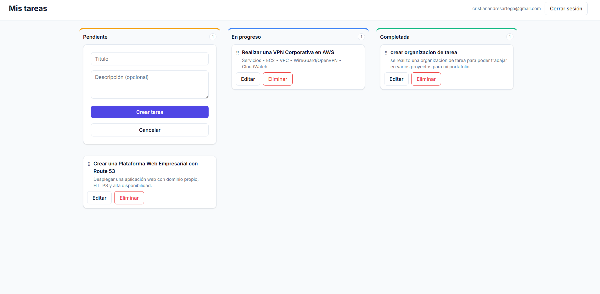

# Task Management System (TMS)

[](https://github.com/CristianAndres-Arteaga/task-management-system/actions/workflows/backend-ci.yml)
[](https://github.com/CristianAndres-Arteaga/task-management-system/actions/workflows/backend-deploy.yml)
[](https://github.com/CristianAndres-Arteaga/task-management-system/actions/workflows/frontend-ci.yml)
[](https://github.com/CristianAndres-Arteaga/task-management-system/actions/workflows/frontend-deploy.yml)
[](LICENSE)

Una aplicación full-stack de gestión de tareas, serverless, construida sobre AWS para practicar patrones de cloud engineering de nivel profesional: IAM de mínimo privilegio, CI/CD basado en OIDC, diseño single-table en DynamoDB, y observabilidad de punta a punta — todo dentro de la capa gratuita de AWS.

**Demo en vivo:** https://d1n5bx4uzfv4qq.cloudfront.net
**Repositorio:** https://github.com/CristianAndres-Arteaga/task-management-system

_[English version](README.md)_

---

## Arquitectura



El backend sirve tres flujos independientes: registro (Cognito → Lambda PostConfirmation → DynamoDB), login (Cognito, solo emisión de tokens), y CRUD autenticado (HTTP API → JWT Authorizer de Cognito → una Lambda por operación → DynamoDB). Un camino de observabilidad separado envía los logs de las Lambdas a CloudWatch y enruta las alarmas hacia SNS y de ahí a email.

## Stack Tecnológico

**Backend**
- AWS SAM (Infraestructura como código)
- AWS Lambda — Node.js/TypeScript, una función por operación CRUD, x86_64
- Amazon API Gateway — HTTP API con JWT Authorizer de Cognito
- Amazon DynamoDB — diseño single-table, capacidad on-demand
- Amazon Cognito — User Pools, autenticación SRP
- Amazon CloudWatch — Logs, Alarms, Dashboard
- Amazon SNS — alertas por email
- GitHub Actions — CI/CD vía federación OIDC (sin credenciales de AWS almacenadas)

**Frontend**
- React 18 + TypeScript, Vite
- Tailwind CSS v4
- Axios
- @dnd-kit/core — drag & drop del tablero Kanban
- Amazon S3 (privado) + Amazon CloudFront (OAC) — hosting estático

## Funcionalidades

- Autenticación con email/contraseña vía Cognito (registro, confirmación, login, logout)
- Tablero Kanban — tres columnas (Pendiente / En progreso / Completada) mapeadas 1:1 con TaskStatus, drag-and-drop entre columnas
- Creación de tareas inline (estilo Trello, directo en la columna Pendiente)
- Edición/eliminación inline con diálogo de confirmación custom
- Aislamiento estricto de datos por usuario — cada operación del backend se restringe al `sub` del token JWT del usuario autenticado, nunca a un ID provisto por el cliente

| Login | Tablero Kanban |
|---|---|
|  |  |

## Cómo Empezar

### Prerrequisitos

- Node.js 20+
- AWS CLI configurado con credenciales
- AWS SAM CLI
- Una cuenta de AWS

### Backend

```bash
cd backend/tms-backend
sam build
sam deploy --guided
```

`sam deploy --guided` va a pedir el parámetro `AlertEmail` (ver Variables de Entorno) y guarda tus elecciones en `samconfig.toml`.

### Frontend

```bash
cd tms-frontend
npm install
```

Creá un archivo `.env` (ver Variables de Entorno abajo), y luego:

```bash
npm run dev
```

## Variables de Entorno

**Frontend (`tms-frontend/.env`)**

- `VITE_API_URL` — URL de invocación del HTTP API Gateway, incluyendo el stage `/prod`
- `VITE_COGNITO_USER_POOL_ID` — ID del User Pool de Cognito
- `VITE_COGNITO_USER_POOL_CLIENT_ID` — ID del App Client de Cognito

Son identificadores no-secretos — terminan en el bundle del navegador de todas formas, por lo que hardcodearlos en el CI es seguro.

**Backend (parámetro de SAM)**

- `AlertEmail` — dirección de email que recibe las notificaciones de alarmas de CloudWatch vía SNS

## CI/CD

Cuatro workflows de GitHub Actions, todos bajo `.github/workflows/`:

- **backend-ci.yml** — en PRs que tocan `backend/tms-backend/**`: corre los tests unitarios de cada Lambda (DynamoDB mockeado con `aws-sdk-client-mock`, sin necesidad de credenciales de AWS), luego `sam validate --lint && sam build`.
- **backend-deploy.yml** — en push a `main` (+ disparo manual): asume un rol de IAM vía OIDC y corre `sam build && sam deploy`.
- **frontend-ci.yml** — en PRs que tocan `tms-frontend/**`: `npm ci && npm run lint && npm run build`.
- **frontend-deploy.yml** — en push a `main` (+ disparo manual): compila la SPA, la sincroniza a S3, e invalida la caché de CloudFront.

La autenticación usa federación OIDC, no access keys de larga duración. GitHub Actions intercambia un token OIDC de corta duración por credenciales temporales de AWS vía `AssumeRoleWithWebIdentity`, restringido a la rama `main` de este repositorio — no hay secretos de AWS almacenados en GitHub en absoluto.

## Decisiones de Arquitectura

- **HTTP API en vez de REST API** — Más barato, y trae un JWT Authorizer de Cognito nativo, así que no hace falta un Lambda authorizer custom.
- **DynamoDB single-table, sin GSI** — `PK=USER#<sub>`, `SK=PROFILE|TASK#<id>` cubre todos los patrones de acceso solo con la partition key a esta escala; un GSI sería prematuro.
- **Una Lambda por operación** — Menor radio de impacto por función, IAM de mínimo privilegio escalado individualmente, escalado y monitoreo independientes. Nada de Lambda-lith.
- **Federación OIDC para CI/CD** — Elimina por completo las credenciales de AWS de larga duración en GitHub, en vez de solo restringirlas.
- **Límite de IAM de mínimo privilegio** — Una policy de deploy acotada maneja los cambios rutinarios; cualquier cosa fuera de ese alcance (incluyendo editar la propia policy de deploy) requiere asumir un rol de admin separado, deliberadamente más difícil de alcanzar.
- **CloudFront + S3 privado (OAC)** — El bucket nunca es público; todo el tráfico pasa forzosamente por el borde HTTPS de CloudFront.
- **Sin MFA en Cognito** — Trade-off aceptado a escala de portfolio, documentado y no un descuido.
- **Sin dominio custom / sin WAF** — Decisión de evitar costos: ambos tienen un costo mensual recurrente pequeño pero real, fuera de la capa siempre-gratuita.

## Costos

Todo el stack corre dentro de la capa gratuita de AWS (Lambda, DynamoDB on-demand, CloudFront, alarmas de CloudWatch, SNS y S3 a este nivel de tráfico caen dentro de la capa gratuita de 12 meses o la Always Free) — **$0/mes** para correr y hacer demos. A escala de producción, el principal driver de costo pasaría a ser la facturación de Cognito por MAU por encima de 50.000 usuarios activos mensuales, que escala con el uso real del negocio en vez de ser costo ocioso desperdiciado.

## Limitaciones Conocidas / Roadmap

- Sin dominio custom (sirve desde el dominio default de CloudFront)
- Sin WAF delante de CloudFront
- Sin MFA en Cognito
- Una sola región de AWS, sin multi-región/DR
- Sin tests automatizados de frontend (las Lambdas del backend sí tienen cobertura de tests; el frontend todavía no)
- Un solo stage fijo de API (`prod`) — sin entorno de staging separado

## Licencia

MIT — ver [LICENSE](LICENSE).
